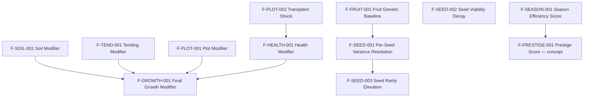

# Formula Registry

This document is the canonical index of gameplay formulas and inter-formula dependencies across the project.

It exists to prevent formula logic from becoming fragmented across multiple data model and process docs. Data model docs define fields. Formula docs define math. This registry defines ownership, dependencies, and where each formula fits in the larger simulation.

> Related docs: [Lifecycle Formulas](./LIFECYCLE-FORMULAS.md) | [Data Models](./data-models/PEPPER.md) | [Genetics](./GENETICS.md)

## Purpose

The registry answers four questions for every formula:

- What is this formula responsible for?
- Which objects and fields does it read?
- Which objects and fields does it write or influence?
- Which other formulas depend on it?

This creates a lightweight dependency map that can scale as the game grows.

## Status Levels

Each formula should carry one lifecycle status:

| Status | Meaning |
|---|---|
| `concept` | Mentioned as a need, but not yet defined |
| `draft` | Initial formula shape exists, but tuning or edge cases are unresolved |
| `approved` | Design intent is agreed on and stable enough to implement |
| `implemented` | Exists in code and should match the registry |
| `needs_revision` | Previously defined, but known to be outdated or incomplete |

## Formula Categories

| Category | Meaning |
|---|---|
| `progression` | Runs over time, typically per tick |
| `interaction` | Computes how two or more objects affect one another |
| `resolution` | Resolves a one-time outcome at a specific event |
| `derived` | Computes a summary or classification from existing state |

## Formula Template

Use this shape for every new formula added to the project:

```md
### F-<DOMAIN>-<NNN> — <Name>

- Status: `draft`
- Category: `interaction`
- Owner: `docs/LIFECYCLE-FORMULAS.md`
- Reads:
  - `Object.field`
- Writes / Influences:
  - `Object.field`
- Depends On:
  - `F-OTHER-001`
- Used By:
  - `F-OTHER-002`
- Trigger:
  - Per tick / on pollination / on harvest / on season rollover

Definition:

```text
formula here
```

Notes:
- key assumptions

Open Questions:
- unresolved details
```

## Dependency Graph

This graph is intentionally high-level. It shows formula relationships, not every field-level edge.



## Active Registry

### F-SOIL-001 — Soil Modifier

- Status: `approved`
- Category: `interaction`
- Owner: [LIFECYCLE-FORMULAS.md](./LIFECYCLE-FORMULAS.md#soil-seed-affinity)
- Reads:
  - `Seed.genetics.soilAffinity.*`
  - `Seed.genetics.traitGenome.hardiness.inheritedValue`
  - `Seed.genetics.traitGenome.droughtResistance.inheritedValue`
  - `Soil.conditions.currentPh`
  - `Soil.nutrients.nitrogen`
  - `Soil.nutrients.phosphorus`
  - `Soil.nutrients.potassium`
  - `Soil.conditions.moistureLevel`
- Writes / Influences:
  - `soilModifier`
- Depends On:
  - none
- Used By:
  - `F-GROWTH-001`
- Trigger:
  - Per tick during growth evaluation

Definition:

```text
tolerance = 0.75 * Seed.genetics.traitGenome.hardiness.inheritedValue
          + 0.25 * Seed.genetics.traitGenome.droughtResistance.inheritedValue

For each soil factor:
  delta = |normalize(actual) - normalize(preferred)|

Apply plateau + falloff to each factor modifier.

nutrientModifier = average(nitrogenModifier, phosphorusModifier, potassiumModifier)
soilModifier     = phModifier * average(nutrientModifier, moistureModifier)
```

Notes:
- `pH` is a gatekeeper and multiplies against the nutrient/moisture result.
- All factor comparisons assume normalized values before delta calculation.
- Individual factor modifiers cap at `1.0` in V1.

Open Questions:
- What is the minimum behavior at `soilModifier = 0.0`?
- Should any soil factor have a non-linear weight in V1 besides pH?

### F-TEND-001 — Tending Modifier

- Status: `draft`
- Category: `interaction`
- Owner: [LIFECYCLE-FORMULAS.md](./LIFECYCLE-FORMULAS.md#growth-modifier-formula)
- Reads:
  - recent qualified tending actions
  - `Plant.tending.lastTendedAtTick`
  - `Plant.tending.careScore`
  - `Plant.tending.autoTendEnabled`
  - relevant `Plant.health.activeEffects`
- Writes / Influences:
  - `Plant.tending.careScore`
  - `tendingModifier`
- Depends On:
  - none
- Used By:
  - `F-GROWTH-001`
- Trigger:
  - On qualified tending action and per tick during growth evaluation

Definition:

```text
floor = if Plant.tending.autoTendEnabled then 0.40 else 0.00

careScore_next = floor + (careScore_current - floor) * 0.80

if careScore <= 0.40:
  tendingModifier = 0.90 + 0.25 * careScore
else:
  tendingModifier = 1.00 + 0.15 * ((careScore - 0.40) / 0.60)
```

Notes:
- Qualified actions must address a real need to grant full value.
- The intended V1 band is `0.90-1.15`, with `1.00` as the idle-friendly baseline.
- Mini-game success should enhance a valid tending event, not create a parallel multiplier.

Open Questions:
- Should anti-spam use per-category cooldowns, diminishing returns, or both?
- Should mini-game success feed `careScore` directly or resolve through a short-lived care event wrapper?

### F-PLOT-001 — Plot Modifier

- Status: `draft`
- Category: `interaction`
- Owner: [PLOT.md](./data-models/PLOT.md#formula-integration)
- Reads:
  - `Plot.supportedStages`
  - `Plot.capacity.rootVolumePerSlot`
  - `Plant.growth.stage`
  - plant size / root-space pressure signals
- Writes / Influences:
  - `plotModifier`
- Depends On:
  - none
- Used By:
  - `F-GROWTH-001`
- Trigger:
  - Per tick during growth evaluation

Definition:

```text
plotModifier = stageModifier * rootSpaceModifier
```

Notes:
- `stageModifier` should distinguish between `optimal`, `marginal`, and `unsupported`.
- `unsupported` may be a hard progression gate, not just a low multiplier.
- `rootSpaceModifier` reflects container pressure as plants outgrow the plot.

Open Questions:
- What numeric value maps to `marginal`?
- Is `unsupported` represented as `0.0`, a blocked state transition, or both?

### F-PLOT-002 — Transplant Shock

- Status: `draft`
- Category: `resolution`
- Owner: [PLOT.md](./data-models/PLOT.md#transplanting)
- Reads:
  - `Plot.risks.transplantShockMultiplier`
  - `Seed.genetics.traitGenome.hardiness.inheritedValue`
  - `Seed.genetics.traitGenome.droughtResistance.inheritedValue`
- Writes / Influences:
  - temporary plant health penalty
  - `transplant_shock` status effect
- Depends On:
  - none
- Used By:
  - `F-HEALTH-001`
- Trigger:
  - On transplant

Definition:

```text
shockSeverity = Plot.risks.transplantShockMultiplier
              * (1 - (0.5 * Seed.genetics.traitGenome.hardiness.inheritedValue
                    + 0.5 * Seed.genetics.traitGenome.droughtResistance.inheritedValue))
```

Notes:
- Soil does not travel with the plant. The plant interacts with the destination soil immediately.
- This formula is a good example of a one-time event that influences later per-tick formulas.

Open Questions:
- How many ticks should transplant shock last?
- Does transplant timing within a stage affect severity?

### F-HEALTH-001 — Health Modifier

- Status: `concept`
- Category: `derived`
- Owner: [LIFECYCLE-FORMULAS.md](./LIFECYCLE-FORMULAS.md#growth-modifier-formula)
- Reads:
  - plant health state
  - status effects such as `transplant_shock`
  - plot risk outcomes
- Writes / Influences:
  - `healthModifier`
- Depends On:
  - `F-PLOT-002`
- Used By:
  - `F-GROWTH-001`
- Trigger:
  - Per tick during growth evaluation

Definition:

```text
healthModifier = TBD
```

Notes:
- Health should become the shared sink for stressors like transplant shock, drought, mold, or root binding.
- This is a central dependency point and should stay simple.

Open Questions:
- Is health a single scalar or a composite of stress channels?
- What is the recovery model for temporary penalties?

### F-GROWTH-001 — Final Growth Modifier

- Status: `draft`
- Category: `progression`
- Owner: [LIFECYCLE-FORMULAS.md](./LIFECYCLE-FORMULAS.md#final-growth-modifier)
- Reads:
  - `soilModifier`
  - `tendingModifier`
  - `healthModifier`
  - `plotModifier`
- Writes / Influences:
  - per-tick lifecycle progression rate
- Depends On:
  - `F-SOIL-001`
  - `F-TEND-001`
  - `F-HEALTH-001`
  - `F-PLOT-001`
- Used By:
  - future lifecycle stage progression formulas
- Trigger:
  - Per tick during growth evaluation

Definition:

```text
finalGrowthModifier = min(1.25, soilModifier * tendingModifier * healthModifier * plotModifier)
```

Notes:
- This is the main aggregation point for growth-related formulas.
- The soft cap allows a small upside from active play without turning modifiers into runaway multipliers.

Open Questions:
- Should there be a minimum growth floor above `0.0`?
- Which future lifecycle stage formulas consume this value directly?

### F-FRUIT-001 — Fruit Genetic Baseline Resolution

- Status: `draft`
- Category: `resolution`
- Owner: [FRUIT.md](./data-models/FRUIT.md#seed-generation)
- Reads:
  - maternal seed genetics
  - paternal seed genetics
  - pollination context
- Writes / Influences:
  - `Fruit.genetics.traitBaseline`
  - `Fruit.genetics.stabilityScore`
  - `Fruit.genetics.varianceRange`
- Depends On:
  - none
- Used By:
  - `F-SEED-001`
- Trigger:
  - On pollination / fruit creation

Definition:

```text
baseMaternalWeight = 0.55
basePaternalWeight = 0.45

stabilityDelta = maternal.stability - paternal.stability
stabilityShift = clamp(stabilityDelta * 0.10, -0.05, 0.05)

maternalWeight = clamp(baseMaternalWeight + stabilityShift, 0.45, 0.60)
paternalWeight = 1 - maternalWeight

baselineValue = maternalWeight * maternal.inheritedValue
              + paternalWeight * paternal.inheritedValue

agreement = 1 - normalizedDistance(maternal.inheritedValue, paternal.inheritedValue)
parentAvg = (maternal.stability + paternal.stability) / 2

reinforcementBonus =
  if self-pollination: 0.08
  else if agreement >= 0.90: 0.05
  else if agreement >= 0.75: 0.02
  else 0.00

divergencePenalty =
  if agreement >= 0.75: 0.00
  else (0.75 - agreement) * 0.40

fruitTraitStability = clamp(
  parentAvg
  + reinforcementBonus * (1 - parentAvg)
  - divergencePenalty,
  0,
  1
)

microNoise = random(-0.15, +0.15) * traitRange * (1 - fruitTraitStability) * 0.15
mutationChance = 0.02 + 0.08 * (1 - fruitTraitStability)

if discrete mutation triggers:
  mutationDelta = random(-0.5, +0.5) * traitRange * (1 - fruitTraitStability)
else:
  mutationDelta = 0

finalInheritedValue = baselineValue + microNoise + mutationDelta

stabilityScore = average(fruitTraitStability across resolved traits)
varianceRange  = MAX_VARIANCE * (1 - stabilityScore)
```

Notes:
- This is the bridge from breeding rules to seed generation.
- `Fruit.genetics.traitBaseline` is a `TraitGenome` carrier, not a flat value map.
- `lockState` tiers for V1 are: `unstable < 0.30`, `drifting 0.30-0.59`, `mostly_stable 0.60-0.84`, `locked >= 0.85`.
- `F-SEED-001` may inspect per-trait stability already present inside `traitBaseline` without expanding the V1 field contract.

Open Questions:
- How should categorical or multi-dimensional traits define `normalizedDistance` in V1?
- Should the breeding mini-game steer parent weights, mutation odds, or preview confidence only?

### F-SEED-001 — Per-Seed Variance Resolution

- Status: `draft`
- Category: `resolution`
- Owner: [FRUIT.md](./data-models/FRUIT.md#seed-generation)
- Reads:
  - `Fruit.genetics.traitBaseline`
  - `Fruit.genetics.stabilityScore`
  - `Fruit.genetics.varianceRange`
- Writes / Influences:
  - `Seed.genetics.traitGenome`
  - `Seed.genetics.overallStability`
  - `Seed.genetics.overallVariance`
  - `Seed.lineage.*`
- Depends On:
  - `F-FRUIT-001`
- Used By:
  - `F-SEED-003`
- Trigger:
  - On seed extraction

Definition:

```text
For each new seed:
  start from Fruit.genetics.traitBaseline
  apply per-seed variance bounded by varianceRange
  tighten each trait when traitBaseline[trait].stability is high
  tighten spread when stabilityScore is high
  widen spread when stabilityScore is low
```

Notes:
- Sibling seeds share a baseline but diverge as individual genetic instances.
- This is one of the most important formulas for preserving the game's bloodline identity.

Open Questions:
- Is variance applied uniformly across traits or weighted by trait-specific stability?
- How are hidden vs visible traits initialized?

### F-SEED-002 — Seed Viability Decay

- Status: `draft`
- Category: `progression`
- Owner: [SEED.md](./data-models/SEED.md#state)
- Reads:
  - `Seed.state.ageInSeasons`
  - season rollover event
- Writes / Influences:
  - `Seed.state.viability`
- Depends On:
  - none
- Used By:
  - future germination or planting formulas
- Trigger:
  - On season rollover for stored seeds

Definition:

```text
viability = DECAY_BASE ^ (ageInSeasons ^ 2)

V1 default:
DECAY_BASE = 0.92
```

Notes:
- Intended shape is mild early loss, steep decline after several stored seasons.
- In V1, viability affects germination success only; it does not reduce later growth or trait quality.
- This remains a simple config-driven formula with one primary tuning constant.

Open Questions:
- Should future storage systems modify `DECAY_BASE` by environment or infrastructure?
- Does poor storage environment ever modify the curve in later versions?

### F-SEED-003 — Seed Rarity Elevation

- Status: `concept`
- Category: `derived`
- Owner: [SEED.md](./data-models/SEED.md#identityrarity-and-identityarchetyperarity)
- Reads:
  - `Seed.identity.archetypeRarity`
  - seed trait values
  - archetype baseline ranges from [PEPPER-ALMANAC.md](./PEPPER-ALMANAC.md)
  - trait stability / lock state
- Writes / Influences:
  - `Seed.identity.rarity`
- Depends On:
  - `F-SEED-001`
- Used By:
  - market, discovery, and collection systems
- Trigger:
  - On seed creation and when rarity is re-evaluated

Definition:

```text
rarity = archetypeRarity + deviation_elevation_formula(...)
```

Notes:
- Rarity should describe unusualness and scarcity, not direct power.
- Stable deviations should count more than unstable spikes.

Open Questions:
- What is the exact elevation threshold model for V1?
- Is there a hard cap on how far rarity can elevate above archetype baseline?

### F-SEASON-001 — Season Efficiency Score

- Status: `draft`
- Category: `derived`
- Owner: `docs/specs/SEASON.md`
- Reads:
  - `Season.selectedLength` — the tier the player committed to (`short | standard | long | boss`)
  - `Season.totalDays` — configured day count for the selected tier
  - `Season.daysUsed` — number of Days the player advanced before completing the Contract
- Writes / Influences:
  - `efficiencyScore` — fed into the Prestige Score calculation (formula TBD)
- Depends On:
  - none
- Used By:
  - future `F-PRESTIGE-001`
- Trigger:
  - On season completion (Contract objectives met)

Definition:

```text
daysRemaining = Season.totalDays - Season.daysUsed

ratioComponent      = (daysRemaining / Season.totalDays) * RATIO_WEIGHT
multiplierComponent = TIER_BONUS[Season.selectedLength] * MULTIPLIER_WEIGHT

efficiencyScore = ratioComponent + multiplierComponent
```

Config defaults (all tunable via playtesting):

```text
RATIO_WEIGHT      = 1.0
MULTIPLIER_WEIGHT = 0.0   // set to 0 initially; collapses formula to ratio-only

TIER_BONUS = {
  short:    0.25,
  standard: 0.00,
  long:    -0.10,
  boss:     0.00   // boss length is fixed; no bonus/penalty for something the player didn't choose
}
```

Notes:
- Setting `MULTIPLIER_WEIGHT = 0` collapses to pure ratio: completion speed relative to available Days is the only signal.
- Setting `RATIO_WEIGHT = 0` collapses to flat tier bonus: only the length choice matters, not how efficiently the player used it.
- Short sessions reward efficiency on both levers when both weights are non-zero — do not double-count during playtesting until ratio behavior is understood first.
- Boss tier is excluded from `TIER_BONUS` upside because its length is player-dictated by the game, not a player choice.

Open Questions:
- What is the intended `efficiencyScore` range, and how does it map onto the final Prestige Score scale?
- What is the intended `efficiencyScore` range, and how does it map onto the final Prestige Score scale? In-Day action quality feeds the score through growth and breeding outcomes, not through this formula.

## Maintenance Rules

When adding or changing a formula:

1. Update the canonical formula entry here.
2. Update the owning design doc if the math itself changed.
3. Update `Depends On` and `Used By` links for every affected formula.
4. Update any impacted data model docs so field references stay accurate.
5. If the formula is implemented in code later, add the code location to the entry.

## Recommended Next Additions

The next formulas most likely to need formal registry entries are:

- plant stage progression
- germination success / time-to-sprout
- node production at flowering
- fruit maturation and overripeness
- seed count per fruit
- lineage stability recalculation from observed outcomes
