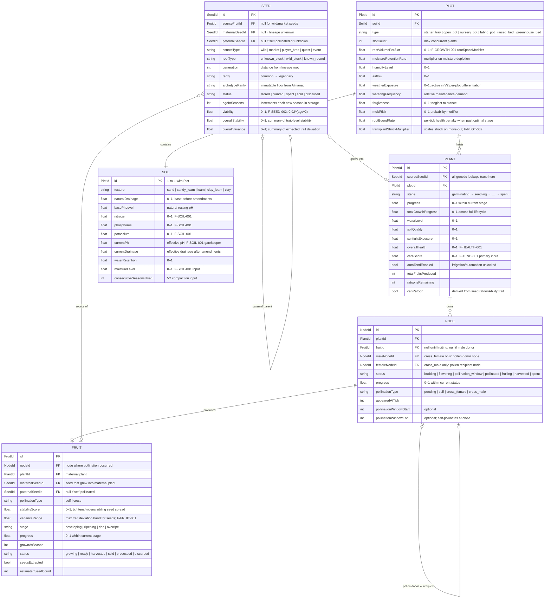

# Pepper Pirate — Data Model ERD

This diagram is the canonical single-view of all core entities and their relationships.
It is generated from the TypeScript interfaces in `src/types/` and must be kept in sync
with any field or relationship change made there.

The game's generational loop runs: **Seed → Plant → Node → Fruit → Seeds (next generation).**

---

---

## Relationship Key

| Relationship | Cardinality | Notes |
|---|---|---|
| SEED → PLANT | 0..1 : 0..1 | One seed grows into at most one active plant; one plant grew from exactly one seed |
| PLANT → NODE | 1 : 0..n | A plant owns zero or more nodes; each node belongs to exactly one plant |
| NODE → FRUIT | 1 : 0..1 | A node produces at most one fruit; male donors produce none |
| FRUIT → SEED | 0..1 : 0..n | A fruit is the source of zero or more seeds; a seed has zero or one source fruit (null for wild/market) |
| PLOT → SOIL | 1 : 1 | Exactly one soil record per plot (1:1 in V1) |
| PLOT → PLANT | 1 : 0..n | A plot hosts zero or more plants (up to `slotCount`) |
| NODE → NODE | 0..1 : 0..1 | Cross-pollination pairs a male donor node with a female recipient node |
| SEED → SEED | 0..1 : 0..n | Self-referential lineage; a seed has at most two parent seeds (maternal, paternal) |

---

## Formula Touchpoints

| Formula | Reads From | Writes / Produces |
|---|---|---|
| F-SOIL-001 | `Soil.nutrients.*`, `Soil.conditions.currentPh`, `Soil.conditions.moistureLevel`, `Seed.genetics.traitGenome.hardiness`, `Seed.genetics.traitGenome.droughtResistance` | `soilModifier` → F-GROWTH-001 |
| F-TEND-001 | `Plant.tending.careScore`, `Plant.tending.lastTendedAtTick`, `Plant.health.activeEffects` | `tendingModifier` → F-GROWTH-001 |
| F-GROWTH-001 | `soilModifier`, `tendingModifier`, `healthModifier`, `plotModifier` | `finalGrowthModifier` → `Plant.growth.progress` |
| F-FRUIT-001 | Parent `Seed.genetics.traitGenome` (both parents) | `Fruit.genetics.traitBaseline`, `stabilityScore`, `varianceRange` |
| F-SEED-001 | `Fruit.genetics.traitBaseline`, `Fruit.genetics.varianceRange`, `Fruit.genetics.stabilityScore` | `Seed.genetics.traitGenome` (per-seed variance) |
| F-SEED-002 | `Seed.state.ageInSeasons` | `Seed.state.viability` |
| F-PLOT-002 | `Plot.risks.transplantShockMultiplier`, `Seed.genetics.traitGenome.hardiness`, `Seed.genetics.traitGenome.droughtResistance` | `transplant_shock` StatusEffect |
| F-SEASON-001 | `Season.selectedLength`, `Season.totalDays`, `Season.daysUsed` | `efficiencyScore` → F-PRESTIGE-001 |

> **Note:** `Season` is not yet typed (`season.ts` pending SEASON data model doc). F-SEASON-001 fields are listed here for completeness.

---

## V1 / V2 Scope Markers

Fields and behaviors deferred to V2 are included in the type interfaces for forward compatibility but are not read by any V1 formula:

- `Soil.health.*` — organic matter, compaction, microbial health, salinity
- `Plot.environment.weatherExposure` — per-plot weather differentiation (Zone weather events fire in V1 but affect all plots equally)
- `TraitKey` V2 entries — `plantSize`, `wallThickness`, `pepperSize`, `color`, `shape`, `diseaseResistance`, `soilAdaptability`, `capsaicinDistribution`, `germinationTime`
