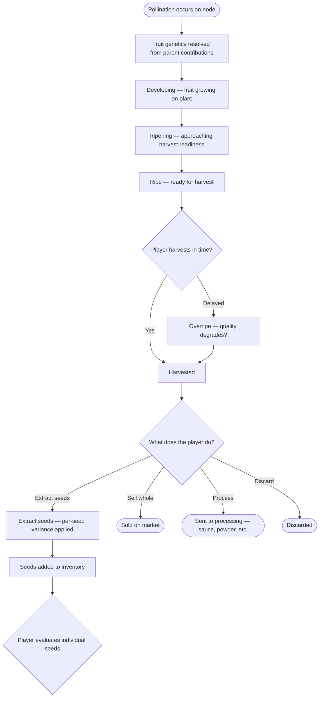

# Fruit Data Model

The **Fruit** (pepper) is the output of a pollinated node. It is the bridge between generations: it inherits genetics from the pollination event that created it, and it determines the genetic baseline for the seeds it contains. Each fruit contains a variable number of seeds, each with per-seed variance applied.

> Related models: [Node](./NODE.md) | [Seed](./SEED.md) | [Plant](./PLANT.md) | [Overview](./PEPPER.md) | [Formula Registry](../FORMULA-REGISTRY.md)

## Design Goals

- The fruit is the generational bridge — it connects the parent plant(s) to the next generation of seeds.
- Fruit genetics are resolved at pollination time, not harvest time.
- Each fruit contains multiple seeds, each with individual variance.
- The fruit's stability determines how tight or wide the variance spread is across its seeds.
- Fruits are what the player harvests, evaluates, sells, processes, or extracts seeds from.

## Proposed Object Shape

```ts
type FruitId = string;
type NodeId = string;
type PlantId = string;
type SeedId = string;
type TraitKey = string; // see SEED.md for full TraitKey union

type Fruit = {
  id: FruitId;

  // Where this fruit came from
  origin: {
    nodeId: NodeId;
    plantId: PlantId;
    pollinationType: "self" | "cross";
    maternalSeedId: SeedId;              // seed that grew into the maternal plant
    paternalSeedId: SeedId | null;       // null if self-pollinated (same as maternal)
  };

  // The fruit's own genetic profile — resolved at pollination time
  genetics: {
    traitBaseline: Partial<Record<TraitKey, TraitGenome>>;  // per-trait baseline genome resolved from both parents
    stabilityScore: number;              // fruit-level summary used to tighten or widen sibling spread
    varianceRange: number;               // fruit-level maximum divergence band for per-seed resolution
  };

  // Growth and lifecycle
  growth: {
    stage: "developing" | "ripening" | "ripe" | "overripe";
    progress: number;                    // 0-1 within current stage
    grownAtSeason: number;
    harvestedAtTick?: number;
  };

  // What the player can observe about this fruit
  expression: {
    visibleTraits: Partial<Record<TraitKey, TraitExpression>>;
    estimatedSeedCount: number;          // how many seeds the player can expect
    qualityGrade?: string;               // derived from trait expression + growth conditions
  };

  // Seeds contained in this fruit
  seeds: {
    seedIds: SeedId[];                   // populated when fruit is harvested and seeds are extracted
    seedsExtracted: boolean;             // whether the player has opened/processed this fruit for seeds
  };

  // What the player has done with this fruit
  state: {
    status: "growing" | "ready" | "harvested" | "sold" | "processed" | "discarded";
  };

  // Player annotations
  metadata: {
    tags: string[];
    notes?: string;
    playerFavorite?: boolean;
  };
};
```

## Fruit Lifecycle



## Field Rationale

### `origin`

Links the fruit back to the specific pollination event. `maternalSeedId` and `paternalSeedId` trace back to the seeds that grew into the parent plants — this is how lineage flows through the fruit to the next generation of seeds.

For self-pollinated fruits, `paternalSeedId` is null because both contributions came from the same plant.

### `genetics`

The fruit's combined genetic profile, resolved at pollination time. This is the baseline from which all contained seeds are derived. The key fields:

- `traitBaseline` — the merged per-trait `TraitGenome` from both parents, including `inheritedValue`, `stability`, `variance`, `lockState`, and `inheritanceSource`
- `stabilityScore` — fruit-level summary that determines how tightly grouped the seeds will be. High stability = seeds are similar. Low stability = wide spread.
- `varianceRange` — the fruit-level numeric bound on how far any individual seed can deviate from the baseline

**Formula IDs:** `F-FRUIT-001`

V1 behavior:

- parent values blend with a bounded maternal bias
- parent agreement and prior stability resolve trait-level stability
- self-pollination reinforces stability gradually rather than instantly locking a line
- mutation uses a hybrid of low continuous noise plus rarer discrete events
- `lockState` is derived from resolved trait stability, not generation count

### `expression`

What the player can observe about the fruit while it's growing and after harvest. Traits become more visible as the fruit matures. `estimatedSeedCount` gives the player a preview of how many seeds to expect, influenced by genetics.

### `seeds`

Seeds are generated when the player extracts them from a harvested fruit. Each seed's genetics = fruit's `traitBaseline` + per-seed variance (bounded by `varianceRange`, influenced by `stabilityScore`).

In practice, V1 per-seed resolution may also read `traitBaseline[trait].stability` so locked traits drift less than unstable ones without requiring an additional explicit fruit field.

**Formula IDs:** `F-SEED-001`

The player must choose to extract seeds — selling or processing the fruit whole means those seeds are lost. This is another meaningful tradeoff: a valuable fruit might be worth more sold whole than the seeds inside it, but those seeds might contain the next great cultivar.

### `state`

Terminal states (`sold`, `processed`, `discarded`) are irreversible. A sold fruit's seeds are gone. This reinforces the decision-making at harvest time.

## Seed Generation

When the player extracts seeds from a fruit:

1. Determine seed count (from fruit genetics / seed volume trait)
2. For each seed:
   - Start with the fruit's `traitBaseline`
   - Apply per-seed variance, bounded by `varianceRange`
   - Tighten the spread if `stabilityScore` is high
   - Tighten individual traits further when their own baseline stability is high
   - Widen the spread if `stabilityScore` is low
3. Each seed gets its own `SeedId`, `genetics`, and `lineage` pointing back to this fruit
4. Seeds are added to the player's inventory

**Registry reference:** `F-FRUIT-001` defines the fruit baseline contract. `F-SEED-001` defines per-seed variance resolution.

## Formula Registry Note

If fruit genetics, seed generation, or stability behavior changes here, update the relevant entries in [FORMULA-REGISTRY.md](../FORMULA-REGISTRY.md) in the same pass.

## Open Questions

- Does overripeness degrade fruit quality, seed quality, or both?
- Can the player partially extract seeds (take some, sell the rest of the fruit)?
- Is seed count always known at harvest, or is it revealed upon extraction?
- Should the fruit store a snapshot of growth conditions (plot quality, weather) that affected its development?
- How should categorical or multi-dimensional traits define parent agreement in `F-FRUIT-001` before trait-family-specific inheritance rules exist?
