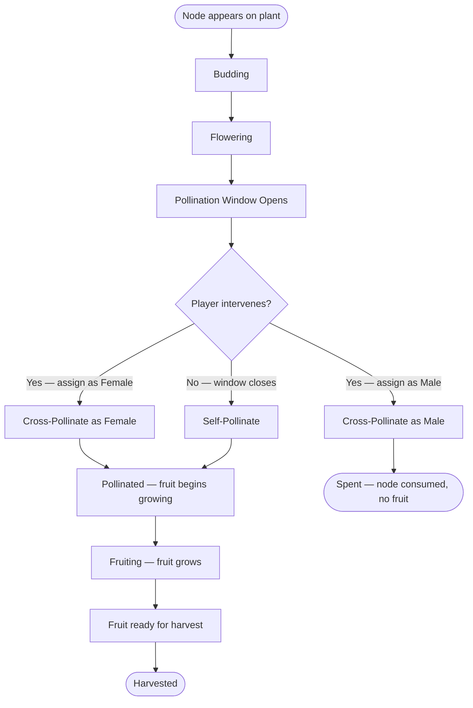

# Node Data Model

A **Node** is a flower/bud site on a plant. Nodes are where pollination happens and fruits originate. Each node has three possible fates: self-pollinate, act as a female recipient in cross-breeding, or act as a male donor in cross-breeding (which consumes the node).

> Related models: [Plant](./PLANT.md) | [Fruit](./FRUIT.md) | [Seed](./SEED.md) | [Overview](./PEPPER.md)

## Design Goals

- Nodes are the unit of breeding interaction — players select specific nodes, not whole plants.
- Cross-pollination has a real cost: the male donor node is consumed and produces no fruit.
- Self-pollination is the default if the player doesn't intervene before the pollination window closes.
- Each node's pollination event determines the genetics of the resulting fruit.

## Proposed Object Shape

```ts
type NodeId = string;
type PlantId = string;
type FruitId = string;

type Node = {
  id: NodeId;

  // Which plant owns this node
  plantId: PlantId;

  // Current state
  state: {
    status: "budding" | "flowering" | "pollination_window" | "pollinated" | "fruiting" | "harvested" | "spent";
    progress: number;                    // 0-1 within current status
  };

  // Pollination details — filled in once pollination occurs
  pollination: {
    type: "pending" | "self" | "cross_female" | "cross_male";
    pollinationTick?: number;

    // For cross_female: which male node provided pollen
    maleNodeId?: NodeId;
    malePlantId?: PlantId;

    // For cross_male: which female node received pollen
    femaleNodeId?: NodeId;
    femalePlantId?: PlantId;
  };

  // Reference to the fruit produced (null if male donor or not yet fruiting)
  fruitId: FruitId | null;

  // Timing
  timing: {
    appearedAtTick: number;
    pollinationWindowStart?: number;     // tick when player can intervene
    pollinationWindowEnd?: number;       // tick when self-pollination occurs automatically
  };
};
```

## Node Lifecycle



## Field Rationale

### `state.status`

Tracks the node through its lifecycle. The key states:

1. **Budding** — node has appeared but isn't ready for pollination
2. **Flowering** — visible flower, approaching pollination window
3. **Pollination window** — the active decision window. Player can assign as female or male for cross-breeding. If the window closes without intervention, the node self-pollinates.
4. **Pollinated** — pollination event has occurred, genetics of future fruit are determined
5. **Fruiting** — fruit is growing on this node
6. **Harvested** — fruit has been collected
7. **Spent** — node was consumed as a male pollen donor. Terminal state, no fruit produced.

### `pollination`

Records exactly how this node was pollinated. This is critical for lineage tracking — the fruit (and its seeds) inherit genetics based on the pollination event.

- **Self-pollinated:** both maternal and paternal genetics come from the same plant's source seed.
- **Cross-female:** maternal genetics from this plant's seed, paternal from the male donor plant's seed.
- **Cross-male:** this node contributed pollen and was consumed. No fruit. The `femalePlantId`/`femaleNodeId` reference lets the player trace where this node's genetics went.

### `timing`

The pollination window is the active gameplay moment. It creates time pressure within a season — not real-time clock pressure (respecting the design philosophy), but in-game tick pressure. The player needs to make breeding decisions while nodes are in their window. Nodes they don't get to will self-pollinate, which is fine but not strategic.

### `fruitId`

Null for male donor nodes (they never fruit) and for nodes that haven't reached the fruiting stage yet. Set once the pollinated node begins growing a fruit.

## Open Questions

- How many nodes does a plant typically produce? Is this a fixed trait, or variable per growth cycle?
- Can the player extend the pollination window through tending or upgrades?
- Is there a mini-game associated with the pollination step itself?
- Can a node be "reserved" by the player before the pollination window to prevent accidental self-pollination?
