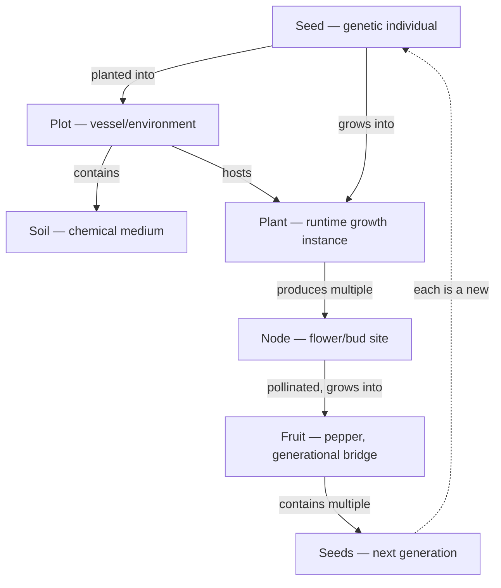

# Data Model Overview

This directory contains the core data models for Pepper Pirate's genetics and gameplay systems.

> Formula source of truth: [FORMULA-REGISTRY.md](../FORMULA-REGISTRY.md)

## Object Hierarchy

The genetic lifecycle flows through six core objects:

## Core Principle

**Genetics flow through seeds, not plants or fruits.** The seed is the genetic individual. Plots are the physical vessels that shape the growing environment. Plants are runtime growth instances. Nodes are pollination sites. Fruits are the generational bridge that resolves parent genetics and applies per-seed variance to produce the next generation.

## Object Responsibilities

| Object | Owns | References |
|---|---|---|
| [Seed](./SEED.md) | Genetics, lineage, trait genome, stability, player identity | Parent fruit, maternal/paternal seed ancestors |
| [Plant](./PLANT.md) | Growth state, health, tending, plot placement, node list | Source seed |
| [Node](./NODE.md) | Pollination state, lifecycle timing, breeding role | Parent plant, partner node (if cross-bred), resulting fruit |
| [Fruit](./FRUIT.md) | Combined parent genetics, seed variance baseline, growth stage | Source node/plant, maternal/paternal seeds, contained seeds |
| [Plot](./PLOT.md) | Vessel/environment — stage support, microclimate, root space, risks, transplanting | Contains soil (1:1), hosts plant, interacts with seed genetics |
| [Soil](./SOIL.md) | Chemical medium — NPK nutrients, pH, drainage, texture | Contained by plot (1:1), affects plant growth via seed-genetics interaction |

## Genetic Flow

1. **Seed** has a unique genetic identity (inherited from parent fruit + per-seed variance)
2. **Seed → Plot → Plant**: player plants a seed into a plot, creating a plant. The plot's environment shapes growing conditions. Plant references seed for all genetic lookups.
3. **Plant → Nodes**: plant produces nodes during flowering stage. Node count influenced by genetics.
4. **Node → Pollination**: each node either self-pollinates (default) or is assigned by the player as a female recipient or male donor in cross-breeding. Male donors are consumed — no fruit.
5. **Pollination → Fruit**: genetics of the fruit are resolved at pollination time from maternal + paternal contributions.
6. **Fruit → Seeds**: when the player extracts seeds, each seed gets the fruit's genetic baseline + per-seed variance. Variance spread is determined by the fruit's stability score.

Relevant formula IDs:
- `F-FRUIT-001` — fruit genetic baseline resolution
- `F-SEED-001` — per-seed variance resolution
- `F-SEED-002` — seed viability decay across stored seasons
- `F-SOIL-001` — soil modifier
- `F-TEND-001` — tending modifier
- `F-PLOT-001` — plot modifier
- `F-PLOT-002` — transplant shock
- `F-GROWTH-001` — final growth modifier

## Key Design Distinctions

### Plot vs Soil
The plot is the physical vessel — it determines stage support, microclimate, root space, and risk profile. Soil is the chemical medium inside the plot — pH, NPK nutrients, moisture. The same soil mix in a starter tray (enclosed, humid) and an open pot (exposed, dry) produces different outcomes. Plot answers "what physical environment does this lifecycle stage need?" while Soil answers "what chemistry and moisture does this pepper want?"

### Seed vs Plant
The seed owns genetics and lineage. The plant is purely runtime — growth progress, health, environmental state. A plant always references back to its source seed for genetic identity.

### Node: The Breeding Unit
Breeding operates at the node level, not the plant level. A single plant can have nodes that self-pollinate AND nodes that cross-pollinate with different partners — producing fruits with different genetic profiles on the same plant.

### Fruit: The Generational Bridge
The fruit is where parent genetics merge and the next generation begins. Fruit genetics are resolved at pollination time. Per-seed variance is applied at extraction time. Selling or processing a fruit whole means its seeds (and their unique genetics) are lost.

### Stability → Variance
A fruit's stability score directly controls how similar or diverse its seeds are. Stable lines produce tight clusters of predictable seeds. Unstable lines produce wide spreads — more risk, but more potential for discovery.

## Related Documentation

- [GENETICS.md](../GENETICS.md) — breeding system design, trait definitions, stability model
- [PRD.md](../PRD.md) — overall game design and gameplay loops
- [Breeding Flow](../process-flows/breeding-flow.md) — process flow for cross-pollination and offspring generation

## Archive

The original first-pass `Pepper` object design (single-object model) has been superseded by this multi-object hierarchy. The original design's field rationale and important design distinctions (generation vs stability, genetics vs expression) remain valid and have been distributed across the appropriate object models.
