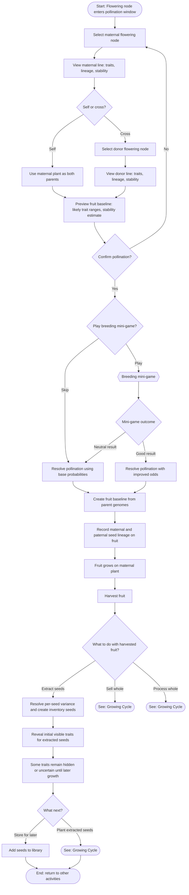

# Breeding Flow

The process of assigning flowering nodes for self-pollination or cross-pollination, then carrying that decision forward into fruit and next-generation seed creation. This is the core mid-game activity and the primary way players discover new varieties and build bloodlines.

## Notes

- **Preview is informational, not deterministic.** The pollination preview shows likely fruit baseline ranges based on parent genetics and stability, but extracted seeds still carry variance — especially in early generations.
- **Mini-game does not guarantee improvement.** It provides *potential* for better results. A neutral mini-game outcome falls back to base probabilities. The player is never worse off for playing.
- **Node-level breeding is canonical.** The player is assigning flowering nodes, not combining harvested peppers or loose seeds directly. Pollination creates a fruit first; extracted seeds come later.
- **Trait revelation is partial.** Not all next-generation seed traits are immediately visible. Some require growing the plant to maturity, or multiple generations, before they fully express. This ties into the "trait expression matures over time" requirement from [GENETICS.md](../GENETICS.md).
- **Chain breeding** is explicitly supported, but it still follows the full lifecycle: pollination -> fruit -> extraction -> replanting.

**Links:**
- [Growing Cycle](./growing-cycle.md) — pollination happens during growth, and extracted seeds can be replanted into the main loop
- [GENETICS.md](../GENETICS.md) — detailed trait, stability, and lineage rules

**Referenced by:**
- [Core Game Loop](./core-game-loop.md) — breeding appears as a flowering-stage action and a broader mid-loop strategy surface
- [Growing Cycle](./growing-cycle.md) — flowering plants route into breeding before harvest
