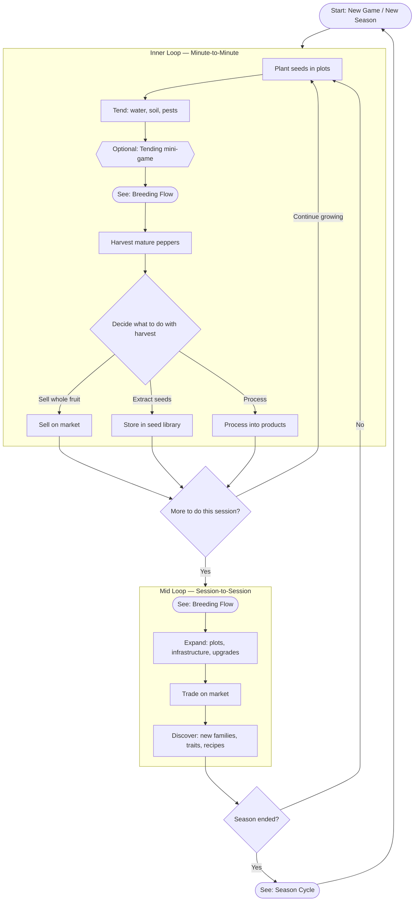

# Core Game Loop

Top-level view of the three nested gameplay loops. This is the entry point for understanding how the game flows.

**Links:**
- [Breeding Flow](./breeding-flow.md) — invoked during flowering/pollination decisions and broader breeding planning
- [Season Cycle](./season-cycle.md) — invoked when the current season ends

**Referenced by:**
- None (this is the top-level flow)
