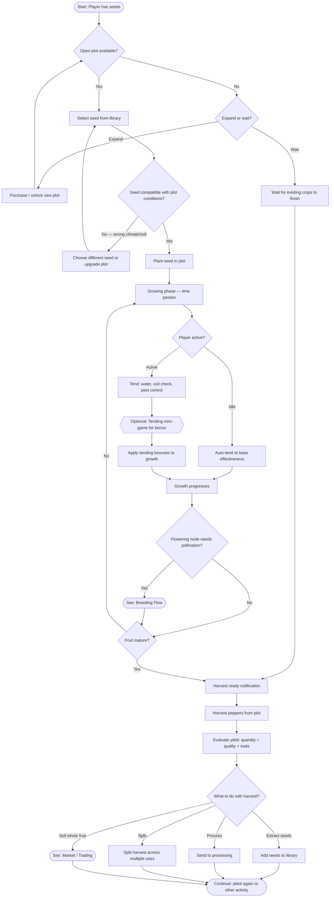

# Growing Cycle

The inner loop in detail: planting, tending, harvesting, and deciding what to do with the yield.

**Links:**
- [Breeding Flow](./breeding-flow.md) — player assigns flowering nodes for selfing or cross-pollination before harvest
- Market / Trading — flow not yet created

**Referenced by:**
- [Core Game Loop](./core-game-loop.md) — this is the detailed view of the inner loop
