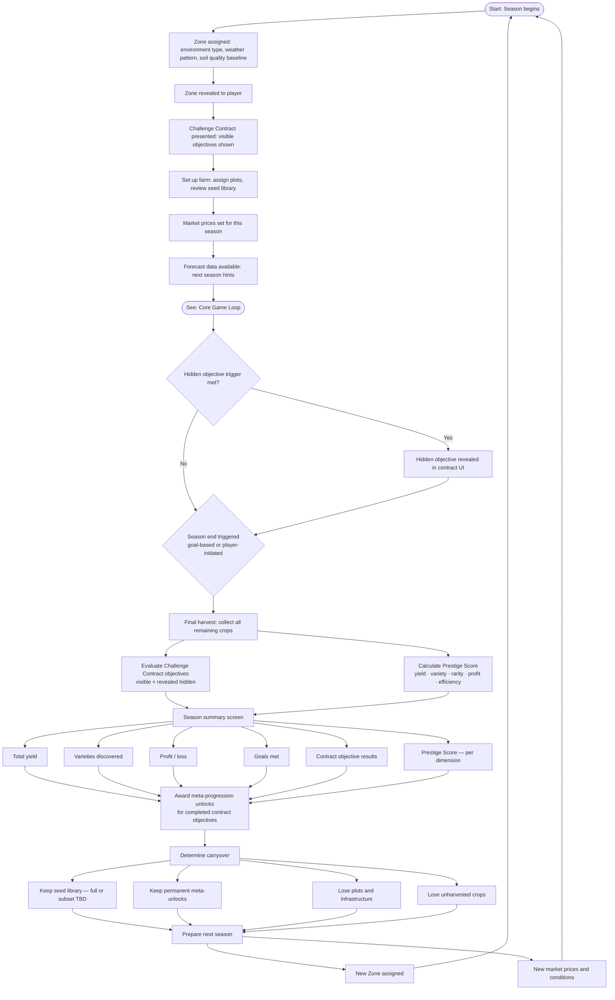

# Season Cycle

The outer loop: how seasons progress, what happens at season boundaries, and what carries over during prestige. Each Season is a roguelike run — a unique Zone configuration, a Challenge Contract, and a Prestige Score evaluation at the end.

## Notes

- **Zone variance:** Each Season starts with a Zone configuration (environment, weather, soil baseline) that varies between runs, requiring players to adapt strategy rather than execute a fixed optimal path. See [season-roguelike-brainstorm.md](../to-review/season-roguelike-brainstorm.md) for Zone dimension details and open questions.
- **Challenge Contracts:** Visible objectives are shown before planting. Hidden objectives unlock mid-season when trigger conditions fire. Contracts are tiered by difficulty; higher tiers unlock via meta-progression. See [SEASON-013 through SEASON-016](../specs/SEASON.md).
- **Season end trigger:** Goal-based (contract completion triggers option to end) or player-initiated. Time-based triggers are avoided to preserve the active-first, idle-supported design pillar (LOOP-002, LOOP-003). Exact trigger logic is an open design question.
- **Prestige Score:** Calculated across five independent dimensions and stored persistently. Displayed as a profile, not a single number. See [SEASON-018, SEASON-019](../specs/SEASON.md).
- **Meta-progression:** Awarded on contract objective completion. Unlocks expand depth across systems (mini-games, breeding, soil) — not raw power. See [SEASON-020](../specs/SEASON.md).
- **Stored seed aging:** Carried seeds remain in the library, but `F-SEED-002` re-evaluates `Seed.state.viability` on season rollover for seeds in `stored` state (SEASON-009).
- **Seed library carryover:** Open design question — does the player keep everything, choose a limited selection, or is carryover gated by prestige currency? This significantly affects reset feel and Zone/genetics investment value each run.

**Links:**
- [Core Game Loop](./core-game-loop.md) — the gameplay that happens during a season
- [Season Roguelike Brainstorm](../to-review/season-roguelike-brainstorm.md) — full design rationale and open questions

**Referenced by:**
- [Core Game Loop](./core-game-loop.md) — season cycle is invoked when a season ends
